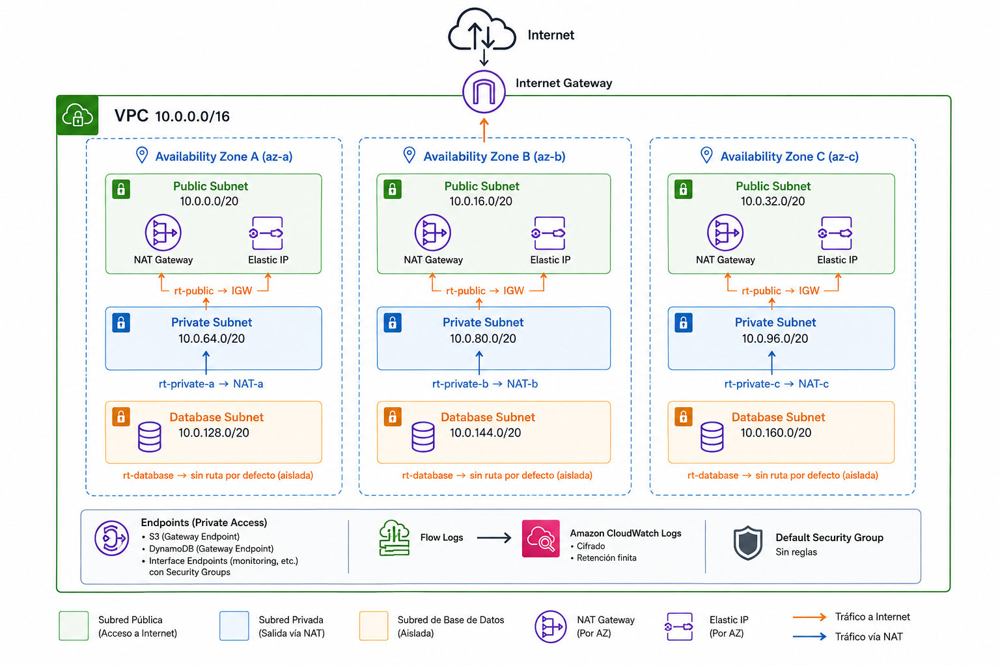

# VPC 

Red base multi-AZ de tres capas sobre AWS

> **Spec de diseño:** [`docs/modules/01-vpc.md`](../../docs/modules/01-vpc.md)

---

## Que resuelve

Crea una VPC lista para produccion con tres capas de subredes (publica, privada y de datos) repartidas entre varias zonas de disponibilidad, con la salida a internet, la observabilidad de red y el endurecimiento por defecto ya resueltos.

Elimina la decison mas cara de revertir de todo el stack: **el direccionamiento**.
Cambiar el tamaño de una instancia es un despliegue, cambiar el plan de CIDRs con produccion encima es una migracion.

## Cuando usarlo

| Úsalo cuando | No lo uses cuando |
|---|---|
| Arrancas un entorno nuevo (dev, stg o prod) en una región | Ya existe una VPC del cliente que debes reutilizar → usa `data "aws_vpc"` |
| Necesitas aislamiento de red para cómputo y datos | Solo despliegas servicios sin VPC (S3 + CloudFront + Lambda no-VPC) |
| Quieres Flow Logs, endpoints y SG por defecto endurecido sin escribirlos | Necesitas topología hub-and-spoke con TGW → este módulo crea el spoke, el TGW va aparte |

## Arquitecturas de ejemplo que lo usan

| Arquitectura | Uso |
|---|---|
| A. ECS Fargate + ALB | Base completa: ALB en pública, tareas en privada, RDS en datos |
| B. Serverless | Solo si hay Lambdas dentro de VPC o Aurora |
| C. Estático + API | No lo necesita salvo que el backend viva en VPC |
| D. Landing Zone | Una VPC por cuenta de workload |
| E. Datos | Redshift, EMR y endpoints de Glue viven aquí |

---

## Diagrama



*(Diagrama ilustrativo con 3 AZ y valores por defecto - `subnet_newbits = 4`, `subnet_slots_per_tier = 4`. El numero real de AZ y de subredes depende de `availability_zones`.)*

---

## Uso minimo 

```hcl
module "vpc" {
  source = "git::https://github.com/benjamin-cloud-pi/PI-Modules.git//modules/vpc?ref=vpc/v1.0.0"

  name        = "acme-dev"
  environment = "dev"

  vpc_cidr           = "10.10.0.0/16"
  availability_zones = ["us-east-1a", "us-east-1b"]

  nat_gateway_mode = "single" # no producción: un solo NAT

  tags = {
    Project    = "acme-plataforma"
    Owner      = "plataforma@acme.com"
    CostCenter = "CC-1042"
  }
}
```

---

Decisiones de diseño

| Decisión | Por qué |
| :--- | :--- |
| **Las AZ se pasan, no se descubren** | `data "aws_availability_zones"` puede devolver un orden distinto entre cuentas y momentos. Un plan reproducible exige AZs explícitas. |
| **`for_each` con clave = AZ, no `count`** | Con `count`, quitar la AZ del medio recrea todas las subredes posteriores. Con clave estable, se destruye solo lo que corresponde. |
| **Tres capas, con la de datos aislada** | Una base de datos sin ruta por defecto a internet es una superficie de ataque materialmente menor y no cuesta nada implementar. |
| **`nat_gateway_mode` como enum, no `single_nat_gateway = bool`** | Un booleano no puede expresar "sin NAT". El enum hace explícito el compromiso coste/resiliencia en el código del cliente. |
| **CIDRs auto-calculados con slots reservados por capa** | Añadir una cuarta AZ añade una subred; no renumera las existentes. |
| **`map_public_ip_on_launch = false` incluso en subredes públicas** | Que una instancia tenga IP pública debe ser una decisión del workload, no una propiedad heredada de la red. |
| **El módulo gestiona el default SG y lo vacía por defecto** | Es un hallazgo recurrente en toda auditoría. Coste de implementación: cero. |
| **Retención de logs validada contra 0** | "Never expire" es la causa número uno de crecimiento silencioso de factura. |
| **El DB subnet group se crea aquí** | Es una construcción de red, no de base de datos. Ponerlo aquí evita que el módulo RDS necesite conocer las subredes. |
| **Sin bloque `provider` ni `backend`** | Declararlos dentro de un módulo rompe el uso con alias y `for_each`, y secuestra una decisión del root. |

Lo que no este modulo no hace

- No crea security groups de aplicacion -> `security-groups`
- No crea claves KMS, recibe un ARN -> `kms`
- No crea el bucket de S3 de los flow logs, recibe solo un ARN -> `s3`
- No gestiona transit gateway, VPC peering ni Direct Connect -> modulos de conectividad
- No crea networks ACLs personalizados. El control por defecto son los sg; las NACL se añaden cuando hay un requisito de cumplimiento que las exija
- No gestiona Route 53 ni hosted Zones privadas -> `route 53`
- No decide el plan de direccionamiento. Recibe el CIDR. El plan global de direcciones del cliente es una decision de arquitectura, no del modulo
- No soporta IPv6. Se añadira cuando exista un cliente que lo requiera, no antes

Errores comunes que este modulo evita

| Error | Consecuencia real | Cómo lo evita |
| :--- | :--- | :--- |
| **VPC de una sola AZ** | Caída total ante fallo de AZ | `validation` exige ≥2 AZ |
| **CIDR solapado con la red on-premise** | Imposible hacer VPN/DX después | El CIDR es explícito y revisable en PR; documentado como decisión previa |
| **VPC demasiado pequeña** | Sin espacio para crecer, migración forzada | `validation` limita el prefijo a `/16`–`/24` |
| **Un solo NAT en producción** | La caída de una AZ deja sin salida a todo el VPC | Default `one_per_az`; `single` obliga a escribirlo |
| **Flow logs desactivados** | Sin evidencia forense tras un incidente | Activados por defecto |
| **Log group sin retención** | Factura de CloudWatch creciente e invisible | `validation` rechaza `0` |
| **Default SG con reglas abiertas** | Hallazgo garantizado en auditoría | Gestionado y vaciado por defecto |
| **Tráfico a S3 saliendo por NAT** | Cargos de procesamiento de datos evitables | Gateway endpoint activo por defecto (es gratis) |
| **Subredes creadas con `count`** | Cambiar la lista de AZ recrea media red | `for_each` con clave estable |
| **Base de datos con ruta a internet** | Exfiltración posible desde la capa de datos | Tabla de rutas de datos sin ruta por defecto |

Cómo probarlo

```bash
# Validación estática (sin credenciales)
terraform fmt -check -recursive
terraform init -backend=false && terraform validate
tflint --recursive
checkov -d . --framework terraform

# Tests de contrato (plan-only, sin credenciales)
terraform test

# Prueba real en la cuenta de laboratorio
cd examples/complete
terraform init && terraform apply
terraform destroy   # debe dejar cero recursos
```

---

## Requisitos y Proveedores

| Nombre | Versión |
| :--- | :--- |
| `terraform` | `~> 1.9` |
| `aws` | `>= 6.0, < 7.0` |

---

## Inputs

<!-- BEGIN_TF_DOCS -->
## Requirements

| Name | Version |
|------|---------|
| <a name="requirement_terraform"></a> [terraform](#requirement\_terraform) | ~> 1.9 |
| <a name="requirement_aws"></a> [aws](#requirement\_aws) | >= 6.0, < 7.0 |

## Providers

| Name | Version |
|------|---------|
| <a name="provider_aws"></a> [aws](#provider\_aws) | >= 6.0, < 7.0 |

## Resources

| Name | Type |
|------|------|
| [aws_cloudwatch_log_group.flow_logs](https://registry.terraform.io/providers/hashicorp/aws/latest/docs/resources/cloudwatch_log_group) | resource |
| [aws_db_subnet_group.this](https://registry.terraform.io/providers/hashicorp/aws/latest/docs/resources/db_subnet_group) | resource |
| [aws_default_security_group.this](https://registry.terraform.io/providers/hashicorp/aws/latest/docs/resources/default_security_group) | resource |
| [aws_eip.nat](https://registry.terraform.io/providers/hashicorp/aws/latest/docs/resources/eip) | resource |
| [aws_flow_log.this](https://registry.terraform.io/providers/hashicorp/aws/latest/docs/resources/flow_log) | resource |
| [aws_iam_role.flow_logs](https://registry.terraform.io/providers/hashicorp/aws/latest/docs/resources/iam_role) | resource |
| [aws_iam_role_policy.flow_logs](https://registry.terraform.io/providers/hashicorp/aws/latest/docs/resources/iam_role_policy) | resource |
| [aws_internet_gateway.this](https://registry.terraform.io/providers/hashicorp/aws/latest/docs/resources/internet_gateway) | resource |
| [aws_nat_gateway.this](https://registry.terraform.io/providers/hashicorp/aws/latest/docs/resources/nat_gateway) | resource |
| [aws_route.database_nat](https://registry.terraform.io/providers/hashicorp/aws/latest/docs/resources/route) | resource |
| [aws_route.private_nat](https://registry.terraform.io/providers/hashicorp/aws/latest/docs/resources/route) | resource |
| [aws_route.public_internet](https://registry.terraform.io/providers/hashicorp/aws/latest/docs/resources/route) | resource |
| [aws_route_table.database](https://registry.terraform.io/providers/hashicorp/aws/latest/docs/resources/route_table) | resource |
| [aws_route_table.private](https://registry.terraform.io/providers/hashicorp/aws/latest/docs/resources/route_table) | resource |
| [aws_route_table.public](https://registry.terraform.io/providers/hashicorp/aws/latest/docs/resources/route_table) | resource |
| [aws_route_table_association.database](https://registry.terraform.io/providers/hashicorp/aws/latest/docs/resources/route_table_association) | resource |
| [aws_route_table_association.private](https://registry.terraform.io/providers/hashicorp/aws/latest/docs/resources/route_table_association) | resource |
| [aws_route_table_association.public](https://registry.terraform.io/providers/hashicorp/aws/latest/docs/resources/route_table_association) | resource |
| [aws_security_group.vpc_endpoints](https://registry.terraform.io/providers/hashicorp/aws/latest/docs/resources/security_group) | resource |
| [aws_subnet.database](https://registry.terraform.io/providers/hashicorp/aws/latest/docs/resources/subnet) | resource |
| [aws_subnet.private](https://registry.terraform.io/providers/hashicorp/aws/latest/docs/resources/subnet) | resource |
| [aws_subnet.public](https://registry.terraform.io/providers/hashicorp/aws/latest/docs/resources/subnet) | resource |
| [aws_vpc.this](https://registry.terraform.io/providers/hashicorp/aws/latest/docs/resources/vpc) | resource |
| [aws_vpc_endpoint.dynamodb](https://registry.terraform.io/providers/hashicorp/aws/latest/docs/resources/vpc_endpoint) | resource |
| [aws_vpc_endpoint.interface](https://registry.terraform.io/providers/hashicorp/aws/latest/docs/resources/vpc_endpoint) | resource |
| [aws_vpc_endpoint.s3](https://registry.terraform.io/providers/hashicorp/aws/latest/docs/resources/vpc_endpoint) | resource |
| [aws_vpc_ipv4_cidr_block_association.secondary](https://registry.terraform.io/providers/hashicorp/aws/latest/docs/resources/vpc_ipv4_cidr_block_association) | resource |
| [aws_vpc_security_group_ingress_rule.vpc_endpoints_https](https://registry.terraform.io/providers/hashicorp/aws/latest/docs/resources/vpc_security_group_ingress_rule) | resource |

## Inputs

| Name | Description | Type | Default | Required |
|------|-------------|------|---------|:--------:|
| <a name="input_availability_zones"></a> [availability\_zones](#input\_availability\_zones) | Lista explicita de AZs donde el modulo desplegara recurso | `list(string)` | n/a | yes |
| <a name="input_environment"></a> [environment](#input\_environment) | Deployment Environment | `string` | n/a | yes |
| <a name="input_name"></a> [name](#input\_name) | Nombre base utilizado para componer el nombre de cada recurso. Convención: <cliente>-<entorno> | `string` | n/a | yes |
| <a name="input_vpc_cidr"></a> [vpc\_cidr](#input\_vpc\_cidr) | Bloque CIDR IPv4 principal de la VPC | `string` | n/a | yes |
| <a name="input_create_database_subnet_group"></a> [create\_database\_subnet\_group](#input\_create\_database\_subnet\_group) | Define si se crea un DB Subnet Group usando las subnets de base de datos. Recomendado cuando la VPC será usada por RDS o Aurora. | `bool` | `true` | no |
| <a name="input_create_database_subnets"></a> [create\_database\_subnets](#input\_create\_database\_subnets) | Indica si se deben crear subnets dedicadas para bases de datos. Recomendado para mantener la capa de datos aislada y sin acceso directo a internet | `bool` | `true` | no |
| <a name="input_create_public_subnets"></a> [create\_public\_subnets](#input\_create\_public\_subnets) | Indica si se deben crear subnets públicas. Desactivar este valor para VPCs privadas que se acceden mediante Transit Gateway, VPN o Direct Connect | `bool` | `true` | no |
| <a name="input_database_subnet_cidrs"></a> [database\_subnet\_cidrs](#input\_database\_subnet\_cidrs) | CIDR explícitos para las subnets de base de datos, uno por cada AZ y en el mismo orden que availability\_zones. Dejar vacío para calcularlos automáticamente. | `list(string)` | `[]` | no |
| <a name="input_database_subnet_tags"></a> [database\_subnet\_tags](#input\_database\_subnet\_tags) | tags adicionales aplicados solo a las subnets de base de datos | `map(string)` | `{}` | no |
| <a name="input_database_subnets_route_to_nat"></a> [database\_subnets\_route\_to\_nat](#input\_database\_subnets\_route\_to\_nat) | Indica si las subnets de base de datos tendrán una ruta por defecto a través de un NAT Gateway. Se recomienda mantener este valor en false y habilitarlo solo cuando la base de datos requiera acceso saliente a internet | `bool` | `false` | no |
| <a name="input_enable_dns_hostnames"></a> [enable\_dns\_hostnames](#input\_enable\_dns\_hostnames) | habilita la asignacion de nombres DNS para recursos dentro de la VPC | `bool` | `true` | no |
| <a name="input_enable_dns_support"></a> [enable\_dns\_support](#input\_enable\_dns\_support) | habilita la resolucion DNS dentro de la VPC. Necesario para Endpoints, RDS, Servicios en ECS | `bool` | `true` | no |
| <a name="input_enable_dynamodb_endpoint"></a> [enable\_dynamodb\_endpoint](#input\_enable\_dynamodb\_endpoint) | Define si se crea un Gtw Endpoint para DynamoDB | `bool` | `false` | no |
| <a name="input_enable_flow_logs"></a> [enable\_flow\_logs](#input\_enable\_flow\_logs) | Define si se habilitan los VPC Flow Logs para registrar el trafico de red en la VPC. (Recomendacion: mantenerlo activo para facilitar el monitoreo y analisis de incidentes) | `bool` | `true` | no |
| <a name="input_enable_s3_endpoint"></a> [enable\_s3\_endpoint](#input\_enable\_s3\_endpoint) | Define si se crea un Gtw Enpoint para S3 | `bool` | `true` | no |
| <a name="input_flow_logs_destination_type"></a> [flow\_logs\_destination\_type](#input\_flow\_logs\_destination\_type) | Donde se almacenaran los VPC Flow Logs. Puede ser CloudWatch o S3 | `string` | `"cloud-watch-logs"` | no |
| <a name="input_flow_logs_kms_key_arn"></a> [flow\_logs\_kms\_key\_arn](#input\_flow\_logs\_kms\_key\_arn) | ARN de la clave KMS utilizada para cifrar el Log Group de CloudWatch. Si se deja en null, se utilizara la clave administrada por AWS | `string` | `null` | no |
| <a name="input_flow_logs_max_aggregation_interval"></a> [flow\_logs\_max\_aggregation\_interval](#input\_flow\_logs\_max\_aggregation\_interval) | Intervalo de agregación de los VPC Flow Logs, en segundos. Los valores permitidos son 60 o 600. | `number` | `600` | no |
| <a name="input_flow_logs_retention_days"></a> [flow\_logs\_retention\_days](#input\_flow\_logs\_retention\_days) | Dias de retencion de los VPC Flow Logs en CloudWatch Logs. Si es null se deriva del entorno: dev 30, stg 90, prod 365. Nunca 0: la retencion infinita es la causa mas comun de crecimiento silencioso de factura. | `number` | `null` | no |
| <a name="input_flow_logs_s3_destination_arn"></a> [flow\_logs\_s3\_destination\_arn](#input\_flow\_logs\_s3\_destination\_arn) | ARN del bucket S3 donde se almacenarán los VPC Flow Logs. Este valor es obligatorio cuando el destino es S3. El bucket debe existir previamente | `string` | `null` | no |
| <a name="input_flow_logs_traffic_type"></a> [flow\_logs\_traffic\_type](#input\_flow\_logs\_traffic\_type) | Especifica el tipo de tráfico que registrarán los VPC Flow Logs: ACCEPT, REJECT o ALL. | `string` | `"ALL"` | no |
| <a name="input_instance_tenancy"></a> [instance\_tenancy](#input\_instance\_tenancy) | tipo de tenacy para las instancias EC2 lanzadas dentro de la VPC | `string` | `"default"` | no |
| <a name="input_interface_endpoint_services"></a> [interface\_endpoint\_services](#input\_interface\_endpoint\_services) | Lista de servicios para crear Interface Endpoints, por ejemplo: ["ecr.api", "ecr.dkr", "logs", "secretsmanager"]. Activar solo los necesarios, ya que tienen costo por AZ. | `list(string)` | `[]` | no |
| <a name="input_interface_endpoints_allowed_cidrs"></a> [interface\_endpoints\_allowed\_cidrs](#input\_interface\_endpoints\_allowed\_cidrs) | Lista de CIDR permitidos para acceder a los Interface Endpoints por HTTPS. Si se deja vacio, usa el CIDR principal de la VPC y los CIDR secundarios | `list(string)` | `[]` | no |
| <a name="input_interface_endpoints_private_dns_enabled"></a> [interface\_endpoints\_private\_dns\_enabled](#input\_interface\_endpoints\_private\_dns\_enabled) | Define si se habilita DNS privado en los Interfaces Endpoints.Permite que las aplicaciones usen los endpoints privados sin cambiar el código. | `bool` | `true` | no |
| <a name="input_manage_default_security_group"></a> [manage\_default\_security\_group](#input\_manage\_default\_security\_group) | Indica si el modulo administrara el SG predeterminado de la VPC, eliminando reglas de ingreso/salida configuradas por default | `bool` | `true` | no |
| <a name="input_map_public_ip_on_launch"></a> [map\_public\_ip\_on\_launch](#input\_map\_public\_ip\_on\_launch) | Define si las instancias lanzadas en subnets públicas reciben una IP pública automáticamente. Se recomienda mantenerlo en false y asignar IP pública solo cuando sea necesario. | `bool` | `false` | no |
| <a name="input_nat_gateway_mode"></a> [nat\_gateway\_mode](#input\_nat\_gateway\_mode) | Define como las subnets privadas tendran salida a internet. 'none' no crea NAT, 'single' crea un NAT compartido para toda la VPC, y 'one\_per\_az' crea un NAT por AZ para mayor disponibilidad | `string` | `"one_per_az"` | no |
| <a name="input_private_subnet_cidrs"></a> [private\_subnet\_cidrs](#input\_private\_subnet\_cidrs) | CIDR explícitos para las subnets privadas, uno por cada AZ y en el mismo orden que availability\_zones. Dejar vacío para calcularlos automáticamente. | `list(string)` | `[]` | no |
| <a name="input_private_subnet_tags"></a> [private\_subnet\_tags](#input\_private\_subnet\_tags) | tags adicionales aplicados a subnets privadas | `map(string)` | `{}` | no |
| <a name="input_public_subnet_cidrs"></a> [public\_subnet\_cidrs](#input\_public\_subnet\_cidrs) | CIDR explícitos para las subnets públicas, uno por cada AZ y en el mismo orden que availability\_zones. Dejar vacío para calcularlos automáticamente. | `list(string)` | `[]` | no |
| <a name="input_public_subnet_tags"></a> [public\_subnet\_tags](#input\_public\_subnet\_tags) | tags adicionales aplicados a subnets publicas | `map(string)` | `{}` | no |
| <a name="input_secondary_cidr_blocks"></a> [secondary\_cidr\_blocks](#input\_secondary\_cidr\_blocks) | Bloques CIDR IPv4 adicionales para la VPC. Se usan si el rango principal se agota; no crean subredes automáticamente | `list(string)` | `[]` | no |
| <a name="input_subnet_newbits"></a> [subnet\_newbits](#input\_subnet\_newbits) | Cantidad de bits que se agregan al CIDR de la VPC para calcular automáticamente los CIDR de las subnets. Por ejemplo, una VPC /16 con newbits=4 genera subnets /20. | `number` | `4` | no |
| <a name="input_subnet_slots_per_tier"></a> [subnet\_slots\_per\_tier](#input\_subnet\_slots\_per\_tier) | Cantidad de espacios de subred reservados por cada capa. Permite dejar lugar para agregar más AZs en el futuro sin cambiar los CIDR existentes. | `number` | `4` | no |
| <a name="input_tags"></a> [tags](#input\_tags) | Tags aplicados a todos los recursos creados. Se esperan tags como (Project, Owner, CostCenter) | `map(string)` | `{}` | no |
| <a name="input_vpc_tags"></a> [vpc\_tags](#input\_vpc\_tags) | tags extras aplicados a la VPC | `map(string)` | `{}` | no |

## Outputs

| Name | Description |
|------|-------------|
| <a name="output_availability_zones"></a> [availability\_zones](#output\_availability\_zones) | Zonas de disponibilidad que abarca la VPC, en el orden utilizado para cada salida de lista de este módulo. |
| <a name="output_database_route_table_id"></a> [database\_route\_table\_id](#output\_database\_route\_table\_id) | ID de la tabla de rutas de base de datos, o null cuando no existe capa de base de datos. |
| <a name="output_database_subnet_cidr_blocks"></a> [database\_subnet\_cidr\_blocks](#output\_database\_subnet\_cidr\_blocks) | Bloques CIDR de las subredes de base de datos, ordenados por availability\_zones. |
| <a name="output_database_subnet_group_name"></a> [database\_subnet\_group\_name](#output\_database\_subnet\_group\_name) | Nombre del grupo de subredes de BD, o null cuando no se crea. Alimentar esto directamente al módulo RDS/Aurora. |
| <a name="output_database_subnet_ids"></a> [database\_subnet\_ids](#output\_database\_subnet\_ids) | IDs de las subredes de base de datos, ordenados por availability\_zones. |
| <a name="output_default_security_group_id"></a> [default\_security\_group\_id](#output\_default\_security\_group\_id) | ID del grupo de seguridad por defecto de la VPC. Expuesto para que las verificaciones de políticas puedan afirmar que no tiene reglas - no está destinado a ser adjuntado a nada. |
| <a name="output_dynamodb_vpc_endpoint_id"></a> [dynamodb\_vpc\_endpoint\_id](#output\_dynamodb\_vpc\_endpoint\_id) | ID del endpoint de gateway de DynamoDB, o null cuando está deshabilitado. |
| <a name="output_flow_log_id"></a> [flow\_log\_id](#output\_flow\_log\_id) | ID del flow log de VPC, o null cuando está deshabilitado. |
| <a name="output_flow_logs_cloudwatch_log_group_arn"></a> [flow\_logs\_cloudwatch\_log\_group\_arn](#output\_flow\_logs\_cloudwatch\_log\_group\_arn) | ARN del grupo de logs de CloudWatch que recibe flow logs, o null cuando los logs van a S3 o están deshabilitados. |
| <a name="output_flow_logs_cloudwatch_log_group_name"></a> [flow\_logs\_cloudwatch\_log\_group\_name](#output\_flow\_logs\_cloudwatch\_log\_group\_name) | Nombre del grupo de logs de CloudWatch que recibe flow logs, o null cuando los logs van a S3 o están deshabilitados. |
| <a name="output_interface_vpc_endpoint_ids"></a> [interface\_vpc\_endpoint\_ids](#output\_interface\_vpc\_endpoint\_ids) | Mapa de nombre corto de servicio a ID de endpoint de interfaz. |
| <a name="output_internet_gateway_id"></a> [internet\_gateway\_id](#output\_internet\_gateway\_id) | ID del internet gateway, o null cuando no existe capa pública. |
| <a name="output_nat_gateway_ids"></a> [nat\_gateway\_ids](#output\_nat\_gateway\_ids) | IDs de los NAT gateways. |
| <a name="output_nat_gateway_mode"></a> [nat\_gateway\_mode](#output\_nat\_gateway\_mode) | Modo de salida realmente aplicado. Devuelto para que módulos posteriores y revisiones de costos puedan afirmarlo. |
| <a name="output_nat_gateway_public_ips"></a> [nat\_gateway\_public\_ips](#output\_nat\_gateway\_public\_ips) | IPs públicas de los NAT gateways. Estas son las direcciones de salida para entregar para lista blanca de IPs de terceros. |
| <a name="output_private_route_table_ids"></a> [private\_route\_table\_ids](#output\_private\_route\_table\_ids) | IDs de las tablas de rutas privadas. |
| <a name="output_private_subnet_cidr_blocks"></a> [private\_subnet\_cidr\_blocks](#output\_private\_subnet\_cidr\_blocks) | Bloques CIDR de las subredes privadas, ordenados por availability\_zones. |
| <a name="output_private_subnet_ids"></a> [private\_subnet\_ids](#output\_private\_subnet\_ids) | IDs de las subredes privadas, ordenados por availability\_zones. Esta es la ubicación por defecto para cómputo. |
| <a name="output_private_subnets_by_az"></a> [private\_subnets\_by\_az](#output\_private\_subnets\_by\_az) | Mapa de zona de disponibilidad a ID de subred privada. |
| <a name="output_public_route_table_id"></a> [public\_route\_table\_id](#output\_public\_route\_table\_id) | ID de la tabla de rutas pública, o null cuando no existe capa pública. |
| <a name="output_public_subnet_cidr_blocks"></a> [public\_subnet\_cidr\_blocks](#output\_public\_subnet\_cidr\_blocks) | Bloques CIDR de las subredes públicas, ordenados por availability\_zones. |
| <a name="output_public_subnet_ids"></a> [public\_subnet\_ids](#output\_public\_subnet\_ids) | IDs de las subredes públicas, ordenados por availability\_zones. |
| <a name="output_public_subnets_by_az"></a> [public\_subnets\_by\_az](#output\_public\_subnets\_by\_az) | Mapa de zona de disponibilidad a ID de subred pública. Usar esto cuando un recurso debe estar anclado a una AZ específica. |
| <a name="output_s3_vpc_endpoint_id"></a> [s3\_vpc\_endpoint\_id](#output\_s3\_vpc\_endpoint\_id) | ID del endpoint de gateway de S3, o null cuando está deshabilitado. |
| <a name="output_vpc_all_cidr_blocks"></a> [vpc\_all\_cidr\_blocks](#output\_vpc\_all\_cidr\_blocks) | Todos los bloques CIDR de la VPC. Consumir esto en módulos de grupos de seguridad en lugar de re-declarar rangos. |
| <a name="output_vpc_arn"></a> [vpc\_arn](#output\_vpc\_arn) | ARN de la VPC. |
| <a name="output_vpc_cidr_block"></a> [vpc\_cidr\_block](#output\_vpc\_cidr\_block) | Bloque CIDR IPv4 principal de la VPC. |
| <a name="output_vpc_endpoints_security_group_id"></a> [vpc\_endpoints\_security\_group\_id](#output\_vpc\_endpoints\_security\_group\_id) | ID del grupo de seguridad que protege los endpoints de interfaz, o null cuando no se solicitaron endpoints de interfaz. |
| <a name="output_vpc_id"></a> [vpc\_id](#output\_vpc\_id) | ID de la VPC. |
| <a name="output_vpc_secondary_cidr_blocks"></a> [vpc\_secondary\_cidr\_blocks](#output\_vpc\_secondary\_cidr\_blocks) | Bloques CIDR IPv4 secundarios asociados con la VPC. |
<!-- END_TF_DOCS -->

### Referencia rápida de variables frecuentes

| Variable | Tipo | Default | Notas |
| :--- | :--- | :--- | :--- |
| `name` | `string` | — | `<cliente>-<entorno>`, ej. `acme-prod` |
| `environment` | `string` | — | `dev` \| `stg` \| `prod` |
| `vpc_cidr` | `string` | — | `/16` a `/24` |
| `availability_zones` | `list(string)` | — | mínimo 2, explícitas |
| `nat_gateway_mode` | `string` | `one_per_az` | `none` \| `single` \| `one_per_az` |
| `create_database_subnets` | `bool` | `true` | capa de datos aislada |
| `enable_flow_logs` | `bool` | `true` | |
| `flow_logs_retention_days` | `number` | `null` | deriva del entorno: dev 30, stg 90, prod 365 |
| `enable_s3_endpoint` | `bool` | `true` | gratis |
| `interface_endpoint_services` | `list(string)` | `[]` | coste por AZ, validar precio vigente antes de activar |
| `manage_default_security_group` | `bool` | `true` | |

---

## Outputs

### Outputs principales

| Output | Consumido por |
| :--- | :--- |
| `vpc_id` | prácticamente todos |
| `private_subnet_ids` | ECS, Lambda, EKS |
| `public_subnet_ids` | ALB público |
| `database_subnet_ids` | RDS, ElastiCache |
| `database_subnet_group_name` | RDS/Aurora directamente |
| `vpc_all_cidr_blocks` | security-groups |
| `nat_gateway_public_ips` | allowlisting de terceros |
| `availability_zones` | módulos que necesitan pinning por AZ |

---

## Versionado

Estrategia de tags: `vpc/vMAJOR.MINOR.PATCH`

| Cambio | Bump |
| :--- | :--- |
| Eliminar/renombrar variable u output | **MAJOR** |
| Cambiar el cálculo de CIDR por defecto (recrea subredes) | **MAJOR** |
| Cambiar el default de `nat_gateway_mode` | **MAJOR** |
| Nueva variable opcional retrocompatible | **MINOR** |
| Nuevo output | **MINOR** |
| Nuevo recurso tras un flag `enable_*` desactivado | **MINOR** |
| Corrección sin cambio de interfaz | **PATCH** |